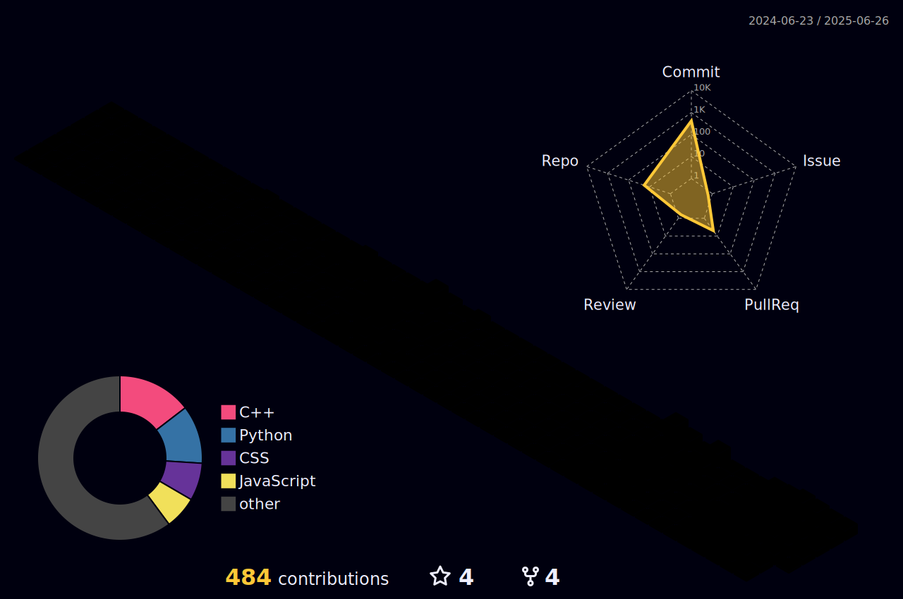

 

- 👋 Hi, I’m Neel Pandey @N-PCs
- 👀 I’m interested in Computer Science and Electronics
- 🌱 I’m currently learning Computer Science Engineering
- 💞️ I’m looking to collaborate in real time collaborative project
- 📫 How to reach me neelpandeyofficial@gmail.com
- 🧑‍💻 LinkedIn  www.linkedin.com/in/neel-pandey-4b7469324
- 😄 Pronouns: He/Him
- ⚡ Fun fact: Always Curious!   :)

  

<h1 align="center">Hi 👋, I'm Neel Pandey @N-PCs</h1>
<h3 align="center">A passionate coder , looking to expand my domain of interest.</h3>

  

## 🏆 GitHub Trophies

- 📫 How to reach me **neelpandeyofficial@gmail.com**

- 📄 Know about my experiences [https://drive.google.com/file/d/1ra9NwU4b0XndAtVai4E0M6isTQAUxPp4/](https://drive.google.com/file/d/1ra9NwU4b0XndAtVai4E0M6isTQAUxPp4/)

<h3 align="left">Connect with me:</h3>

<h3 align="left">Languages and Tools:</h3>

# 📊 GitHub Stats:

 
 

  

###

### 🔝 Top Contributed Repo

## 🌐 Socials:
     

# 💻 Tech Stack:
          

### ✍️ 
 

<picture>
  <source media="(prefers-color-scheme: dark)" srcset="https://raw.githubusercontent.com/N-PCs/N-PCs/output/github-snake-dark.svg" />
  <source media="(prefers-color-scheme: light)" srcset="https://raw.githubusercontent.com/N-PCs/N-PCs/output/github-snake.svg" />
  
</picture>
